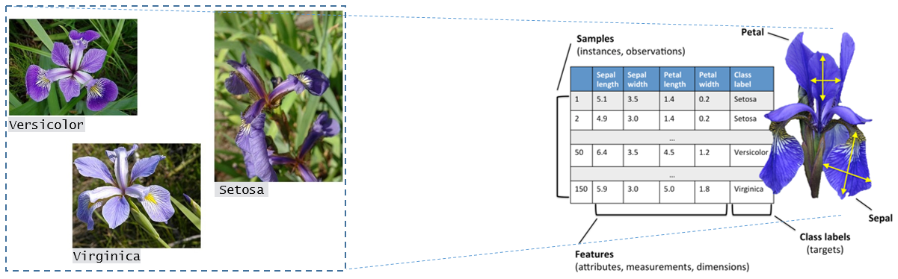
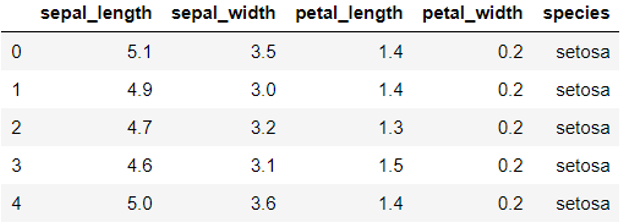
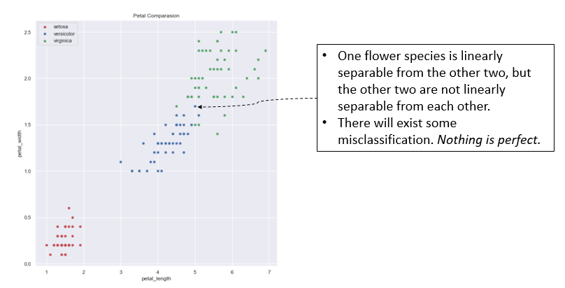

### Assignment!

Write a computer program (*Python programing language*) that trains a series of perceptron's, based on PLA, to classify iris data. here is some basic information:

- Features/Attributes: **Sepal length**, **Sepal width**, **Patel length**, **Patel width** 
- Class labels/Species: **Versicolor**, **Setosa**, **Virginica**



- The Iris dataset includes three iris species, **Versicolor**, **Setosa** and **Virginica**, with 50 samples each, where each sample is represented by four features, **Petal_Length** (in cm), **Petal_Width** (in cm), **Sepal_Length** (in cm) and **Sepal_Width** (in cm), for an Iris flower.

- you can find the iris dataset here: Iris data: [https](https://raw.githubusercontent.com/mwaskom/seaborn-data/master/iris.csv)[://raw.githubusercontent.com/mwaskom/seaborn-data/master/iris.csv](https://raw.githubusercontent.com/mwaskom/seaborn-data/master/iris.csv)

#### Hints:

- Read dataset 

  ```
  >> iris = pd.read_csv('https://raw.githubusercontent.com/mwaskom/seaborn-data/master/iris.csv’)
  >> iris.head()
  ```

  The output will become:

  

- Consider features **Patel length** (*x*1) and **Patel** **width** (*x*2)

- Train two perceptron's producing two decision boundaries for the three classes (a multi-class classification problem)

  - One is for data belonging to (class (red)  ) and (classes (blue and green)   )

  - The other is for data belonging to (class (blue) ) and (class (green) )

  - A *re-labeling* process is needed in this exercise

    

- Show the obtained decision boundaries.


******* *Good Luck !!!* *******

